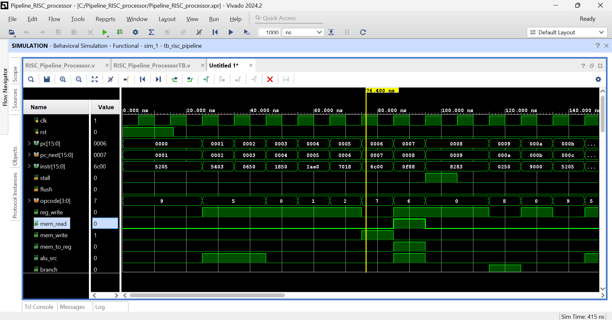
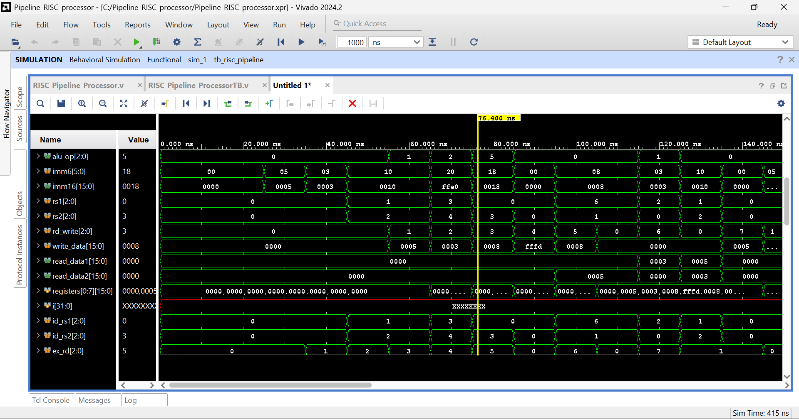
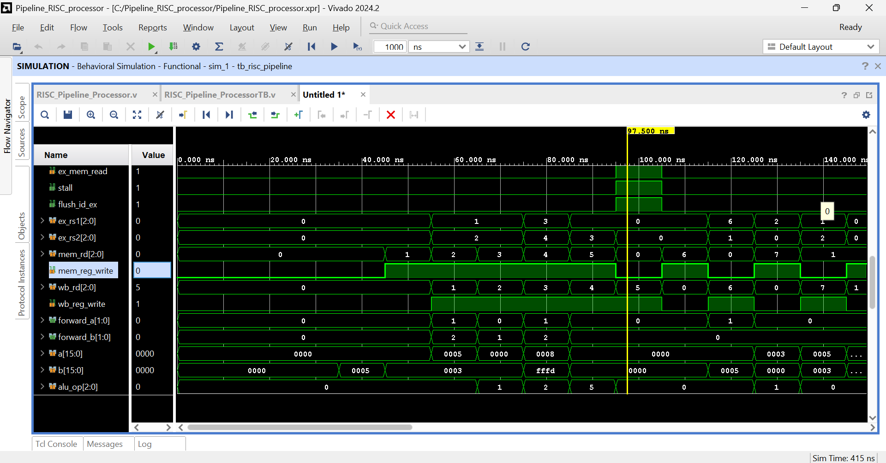
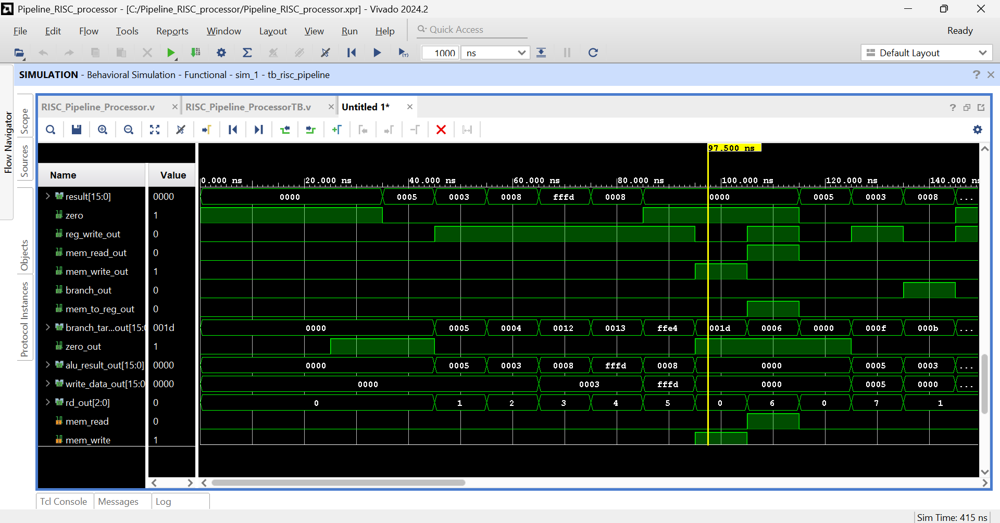
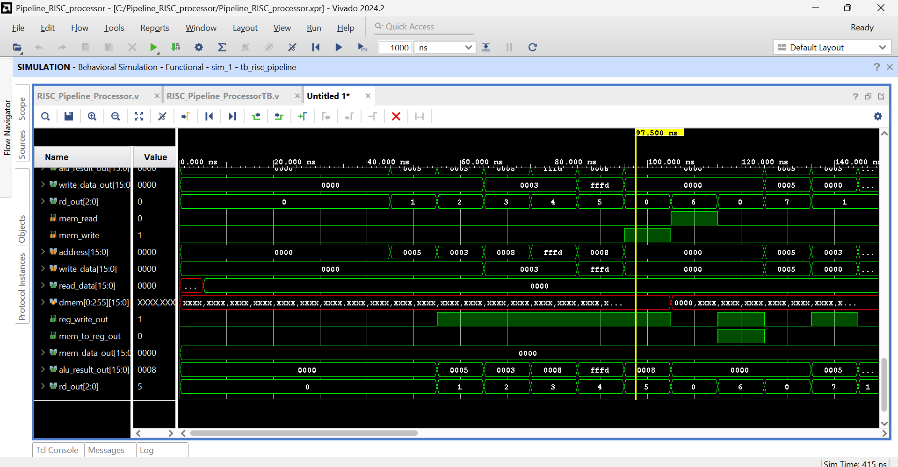
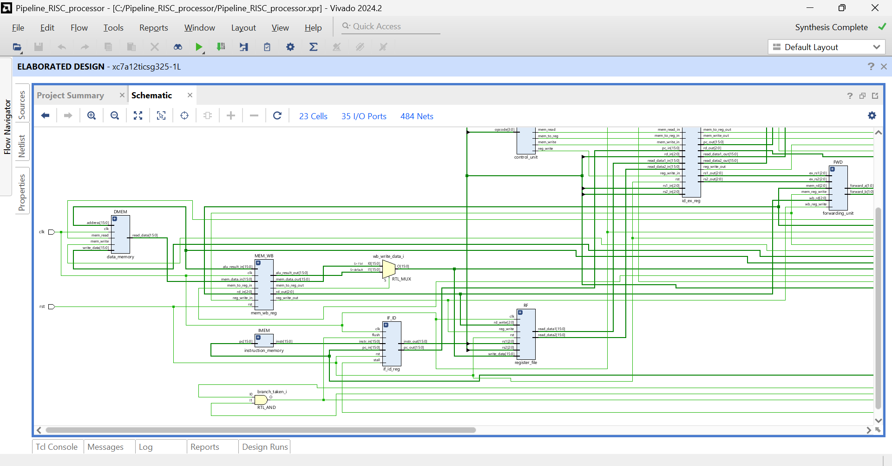
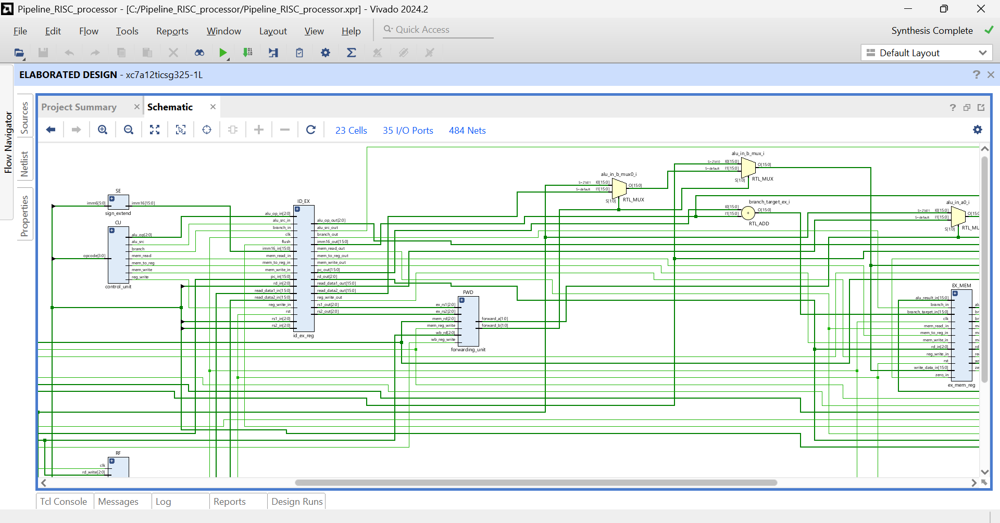
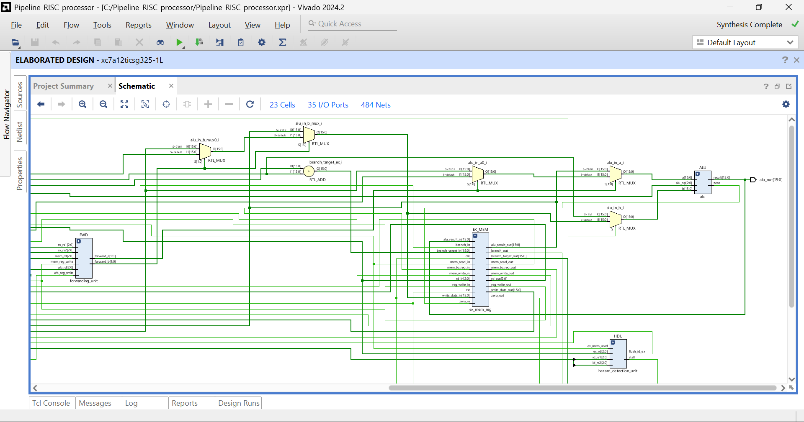
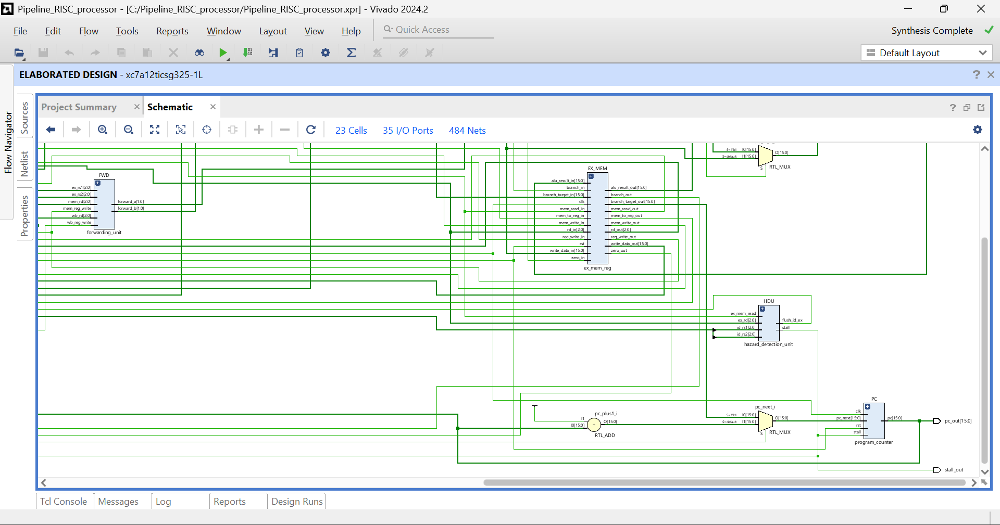

# 16-bit 5-Stage Pipelined RISC Processor
**RTL Design | Verilog HDL | Synthesized on Artix-7 FPGA**

A fully functional 16-bit pipelined RISC processor implemented in Verilog HDL.
Designed with all three classic pipeline hazard solutions.
Synthesized on **Xilinx Vivado 2024.2** targeting **Artix-7 (xc7a12ticsg325-1L)**.

---

## Architecture - 5 Pipeline Stages
IF -> ID -> EX -> MEM -> WB

| Stage | Module | Function |
|-------|--------|----------|
| IF | `program_counter`, `instruction_memory`, `if_id_reg` | Fetch instruction, update PC |
| ID | `register_file`, `control_unit`, `sign_extend`, `id_ex_reg` | Decode, read registers |
| EX | `alu`, `forwarding_unit`, `ex_mem_reg` | Execute, forward data |
| MEM | `data_memory`, `mem_wb_reg` | Load/Store |
| WB | (combinational) | Write result back to register file |

---

## Instruction Set (16-bit)

| Opcode | Instruction | Type | Operation |
|--------|------------|------|-----------|
| 0000 | ADD rd, rs1, rs2 | R | rd = rs1 + rs2 |
| 0001 | SUB rd, rs1, rs2 | R | rd = rs1 - rs2 |
| 0010 | AND rd, rs1, rs2 | R | rd = rs1 & rs2 |
| 0011 | OR rd, rs1, rs2 | R | rd = rs1 \| rs2 |
| 0100 | XOR rd, rs1, rs2 | R | rd = rs1 ^ rs2 |
| 0101 | ADDI rd, rs1, imm6 | I | rd = rs1 + imm6 |
| 0110 | LOAD rd, rs1, imm6 | I | rd = mem[rs1 + imm6] |
| 0111 | STORE rs1, rs2 | R | mem[rs1] = rs2 |
| 1000 | BEQ rs1, rs2, imm6 | I | if rs1==rs2: PC = PC+imm6 |
| 1001 | NOP | - | No operation |

---

## Hazard Handling

### 1. Data Forwarding (EX-EX and MEM-EX)
- Handled by `forwarding_unit`
- Forwards ALU result from EX/MEM register directly to ALU inputs
- Eliminates stalls for back-to-back ALU instructions

### 2. Load-Use Stall
- Handled by `hazard_detection_unit`
- Detects LOAD followed immediately by dependent instruction
- Stalls pipeline for 1 cycle, inserts NOP bubble into ID/EX

### 3. Branch Handling (Flush on Taken)
- BEQ evaluated in EX stage
- If branch taken: flushes IF/ID register (discards wrongly fetched instruction)
- Branch target computed as PC + sign-extended offset

---

## Simulation Results :

### Pipeline Signals & PC Progression

- PC increments 0000 -> 0001 -> ... -> 000b correctly
- `stall` and `flush` pulse at correct cycles
- `mem_read`, `mem_write` assert at correct instruction addresses

### Register File & Datapath

- `registers[0:7]` shows correct values accumulating: R1=5, R2=3, R3=8, R4=fffd
- `write_data` and `rd_write` correctly track WB stage activity

### Forwarding & Hazard Detection

- `stall=1` and `flush_id_ex=1` pulse together on load-use hazard 
- `forward_a` and `forward_b` switch to 2'b10/2'b01 when forwarding active 

### EX/MEM Stage

- `alu_result_out` shows correct values: 0005, 0003, 0008, fffd, 0008
- `branch_out` pulses on BEQ instruction
- `zero_out` reflects equality comparison result

### Memory Stage

- `mem_write=1` at correct cycle -> dmem[0] written with 0008 (R3=8) 
- `mem_read=1` on LOAD -> `read_data` returns 0008 
- STORE + LOAD verified working correctly through data memory

---

## Synthesis Results : Xilinx Artix-7 (xc7a12ticsg325-1L)

| Resource | Used | Available | Utilization |
|----------|------|-----------|-------------|
| Slice LUTs | 331 | 8,000 | 4.14% |
| Flip-Flops | 321 | 16,000 | 2.01% |
| Block RAM (RAMB18) | 1 | 40 | 2.50% |
| I/O Ports | 35 | 150 | 23.33% |
| BUFGCTRL | 1 | 32 | 3.13% |
| DSPs | 0 | 40 | 0.00% |

### RTL Schematics

**Top-level - all 14 modules visible:**

**Execute stage - forwarding unit, ALU, MUX trees:**

**ALU datapath detail:**

**Hazard detection unit & PC logic:**

Full utilization report: [synth/utilization_report.txt](synth/utilization_report.txt)

---

## Project Structure

- src/

   RISC_Pipeline_Processor.v     # All 14 RTL modules

   RISC_Pipeline_ProcessorTB.v   # Testbench

- simulation/                        # Waveform screenshots (5 views)

- synth/                             # Schematic screenshots + utilization report

---

## Tools
- Xilinx Vivado 2024.2
- Target: xc7a12ticsg325-1L (Artix-7, Speed Grade -1L)
- HDL: Verilog (IEEE 1364-2001)
